<q>How can people make good decisions based on limited, noisy information?</q>


---  .nobackground

## Limited Time. Limited information.

<br>


<!-- ---&twocol .nobackground -->


<!-- ## Cook County Hospital, 1996 -->

<!-- ***=left -->
<!-- ```{r, fig.margin = TRUE, echo = FALSE, eval = TRUE, out.width = "100%", fig.align='center'} -->
<!-- knitr::include_graphics(c("images/crowdedemergency.jpg")) -->
<!-- ``` -->

<!-- ***=right -->


<!-- "As the city’s principal public hospital, Cook County was the place of last resort for the hundreds of thousands of Chicagoans without health insurance. Resources were stretched to the limit. The hospital’s cavernous wards were built for another century. There were no private rooms, and patients were separated by flimsy plywood dividers. [\...] Doctors once trained a homeless man to do routine lab tests because there was no one else available." Malcolm Gladwell, Blink. -->


---&twocol

***=left


***=right

### Heart Attack Diagnosis

- How do doctors make decisions? Experience. Intuition. Clinical judgment


- In a Michigan hospital, doctors sent 90% of patients to the ICU, although only 25%  were actually having a heart attack.

---&twocol

## Emergency Room Solution: a fast-and-frugal tree (FFT)

***=left

- A fast-and-frugal decision tree (FFT) developed by Green & Mehr (1997).
- Tree cut the false-alarm rate in half
- Tree is transparent, easy to modify, and accepted by physicians (unlike regression).

### What is a fast-and-frugal decision tree (FFT)?

***=right


Green & Mehr (1997) "What alters physicians' decisions to admit to the coronary care unit?"


--- &twocol

## Fast-and-Frugal Decision Tree (FFT)

- An FFT is a decision tree with exactly two branches from each node, where one, or both, of the branches are exit branches (Martignon et al., 2008)


<!-- #### Descriptive Uses -->

<!-- - Inference (Gigerenzer & Goldstein, 1996) -->
<!-- - Judge's bailing decisions (Dhami, 2003) -->
<!-- - Fish mating (Dugatkin & Godin, 1996) -->

<!-- #### Prescriptive Uses -->

<!-- - Terrorist attacks (Garcia, 2016) -->
<!-- - Bank failure (Neth et al., 2014) -->
<!-- - Depression diagnosis (Jenny et al., 2013) -->


---
## Examples of FFTs


---&twocol
## But how can I create FFTs?

***=left

- Need an algorithm (and preferably software)

| | Algorithms|Software |
|------:|----:|:-----|:----|
|     Standard Decision Trees|  CART, CHAID|SPSS, Excel, R, Matlab, ...     |
|     Fast-and-Frugal Trees (FFTs)|    Max, Zig-zag (Martignon et al., 2003; 2008)|?     |

- *Missing*: An easy to use toolbox that creates and visualizes FFTs based on data.


- *Answer*: FFTrees

***=right


*If you don't like things for free (R), you can pay IBM SPSS $680 / year to make standard decision trees.*


Martignon, Katsikopoulos & Woike (2008)

---&twocol
## FFTrees

***=left

- A package to create, visualize, and evaluate fast-and-frugal decision trees.
- Minimal programming, extensive examples and guides, informative visualizations. 


```r
# 3 Steps to getting started

install.packages("FFTrees") # Install
library("FFTrees")          # Load 
FFTrees_guide()             # Open guide

    0      
   / \     
F   0  
     / \   
    F   T  
 FFTrees v1.3.3
```


***=right


---
## Tutorial and Documentation


---

## Example: Heart Disease


| age| sex|cp | trestbps| chol| fbs|restecg     | thalach| exang| oldpeak|slope | ca|thal   | diagnosis|
|---:|---:|:--|--------:|----:|---:|:-----------|-------:|-----:|-------:|:-----|--:|:------|---------:|
|  63|   1|ta |      145|  233|   1|hypertrophy |     150|     0|     2.3|down  |  0|fd     |         0|
|  67|   1|a  |      160|  286|   0|hypertrophy |     108|     1|     1.5|flat  |  3|normal |         1|
|  67|   1|a  |      120|  229|   0|hypertrophy |     129|     1|     2.6|flat  |  2|rd     |         1|
|  37|   1|np |      130|  250|   0|normal      |     187|     0|     3.5|down  |  0|normal |         0|
|  41|   0|aa |      130|  204|   0|hypertrophy |     172|     0|     1.4|up    |  0|normal |         0|
|  56|   1|aa |      120|  236|   0|normal      |     178|     0|     0.8|up    |  0|normal |         0|


### Goal: Predict binary diagnosis classification


---

## The FFTrees() function


```r
# Step 1: Install and load FFTrees (v.1.3.2)
install.packages("FFTrees")
library("FFTrees")

# Step 2: Create FFTs
heart.fft <- FFTrees(formula = diagnosis ~.,  # Formula
                     data = heart.train,      # Training data
                     data.test = heart.test,  # Test data
                     main = "Heart Disease",  # Optional labels
                     decision.labels = c("Low-Risk", "High-Risk"))
```


---

## Print an `FFTrees` object


```r
heart.fft
```


```r
Heart Disease
7 FFTs predicting diagnosis (Low-Risk v High-Risk)
FFT #1 uses 3 cues: {thal,cp,ca}

                   train   test
cases       :n    150.00 153.00
speed       :mcu    1.74   1.73
frugality   :pci    0.88   0.88
accuracy    :acc    0.80   0.82
weighted    :wacc   0.80   0.82
sensitivity :sens   0.82   0.88
specificity :spec   0.79   0.76

pars: algorithm = 'ifan', goal = 'wacc', goal.chase = 'bacc', sens.w = 0.5
```

---
## Print a tree "in words"


```r
inwords(heart.fft)
```


```r
[1] "If thal = {rd,fd}, predict High-Risk"            
[2] "If cp != {a}, predict Low-Risk"  
[3] "If ca <= 0, predict Low-Risk, otherwise, if ca > 0, predict High-Risk"
```


| cue| definition|Possible values |
|:------|----:|:-----|
|     thal: thallium scintigraphy| How well blood flows to the heart     |normal (n)fixed defect (fd), or reversible defect (rd)|
|     cp: chest pain type| Type of chest pain     | typical angina (ta), atypical angina (aa), non-anginal pain (np), or asymptomatic (a).|
|     ca: |number of major vessels colored by flourosopy     |0, 1, 2, 3    |


---


```r
plot(heart.fft, stats = FALSE, data = "test")
```

```
## Error in plot(heart.fft, stats = FALSE, data = "test"): object 'heart.fft' not found
```


---


```r
plot(heart.fft, data = "test")  # Training data
```

```
## Error in plot(heart.fft, data = "test"): object 'heart.fft' not found
```

---


---


```r
plot(heart.fft, data = "test", tree = 6)   # Testing data, tree 6
```

```
## Error in plot(heart.fft, data = "test", tree = 6): object 'heart.fft' not found
```


---


```r
plot(heart.fft, data = "test", tree = 7)   # Testing data, tree 7
```

```
## Error in plot(heart.fft, data = "test", tree = 7): object 'heart.fft' not found
```


---

<q>How well can simple FFTs compete with classical rational models and cutting-edge machine learning algorithms?</q>


---&twocol

***=left

## Prediction Simulation


- 10 datasets from the UCI Machine Learning Database.
- 50% Training, 50% Testing
- FFTrees vs rpart, regression, random forests...
- Criterion: Balanced accuracy
    - `mean(sensitivity, specificity)`

***=right


---

```
## Error in plot(mushrooms.fft): object 'mushrooms.fft' not found
```


---

```
## Growing FFTs with ifan
```

```
## Fitting non-FFTrees algorithms for comparison (you can turn this off with comp = FALSE) ...
```


---

```
## Growing FFTs with ifan
```

```
## Fitting non-FFTrees algorithms for comparison (you can turn this off with comp = FALSE) ...
```

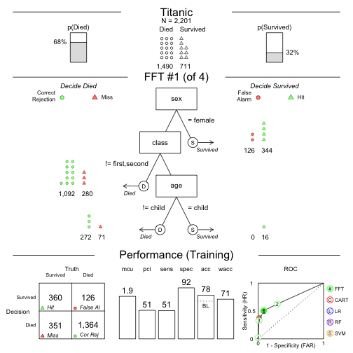


---

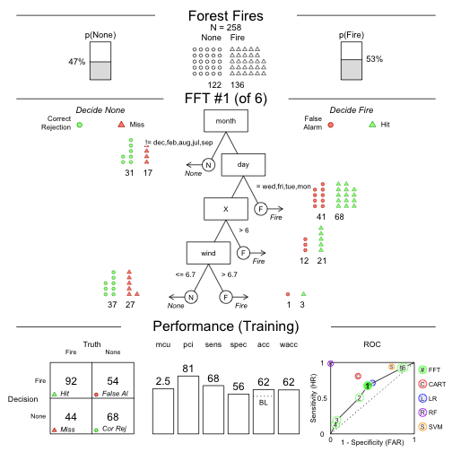

---

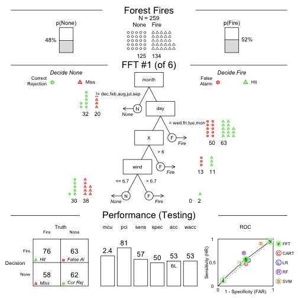


---


--- .class #id 
## Speed and frugality


--- .class #id 
## Speed and frugality


--- .class #id 
## Fitting Accuracy


```
## Error in subset(FFTrees.mlr.df, ((algorithm == "SVM" & task.id %in% c("arrhythmia", : object 'FFTrees.mlr.df' not found
```

```
## Error in int_abline(a = a, b = b, h = h, v = v, untf = untf, ...): plot.new has not been called yet
```


--- .class #id 
## Prediction Accuracy


```
## Error in subset(FFTrees.mlr.df, ((algorithm == "SVM" & task.id %in% c("arrhythmia", : object 'FFTrees.mlr.df' not found
```

```
## Error in int_abline(a = a, b = b, h = h, v = v, untf = untf, ...): plot.new has not been called yet
```


--- .class #id 


<!-- ---&twocol -->

<!-- ***=left -->
<!-- ## Define an FFT manually -->

<!-- ```{r, eval = FALSE, message = FALSE} -->
<!-- # Create an FFT manually -->
<!-- FFTrees(formula = diagnosis ~., -->
<!-- data = heart.train, -->
<!-- my.tree = "If chol > 350, predict True.  -->
<!--            If cp != {a}, predict False.  -->
<!--            If age <= 35, predict False. -->
<!--            Otherwise, predict True") -->
<!-- ``` -->


<!-- ```{r, echo = FALSE} -->
<!-- # Create an FFT manually -->
<!-- my.heart.fft <- FFTrees(formula = diagnosis ~., -->
<!--         data = heart.train, -->
<!--         my.tree = "If chol > 350, predict True.  -->
<!--                    If cp != {a}, predict False.  -->
<!--                    If age <= 35, predict False. -->
<!--                    Otherwise, predict True") -->
<!-- ``` -->

<!-- ***=right -->

<!-- ```{r, out.width = "100%", echo = FALSE} -->
<!-- plot(my.heart.fft, stats = TRUE) -->
<!-- ``` -->


---
## ShinyFFTrees

- A point-and click (no programming), web-based version of FFTrees with around 90% of the funcionality of FFTrees
- Demo: http://econpsychbasel.shinyapps.io/ShinyFFTrees/


---

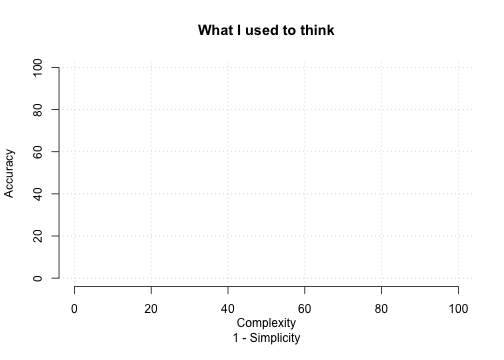


---

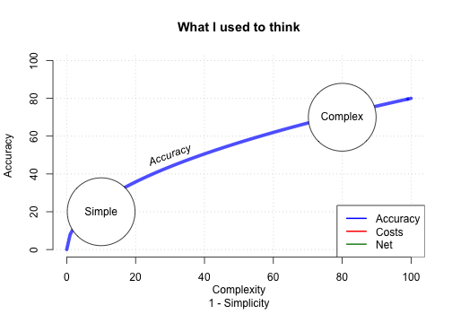


---

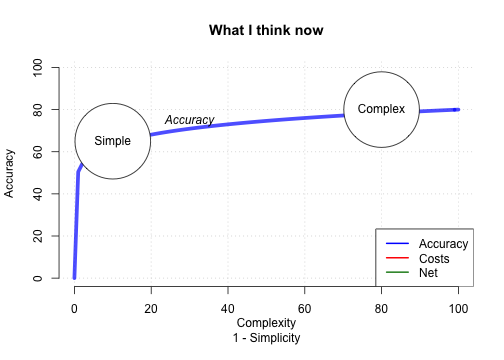


---

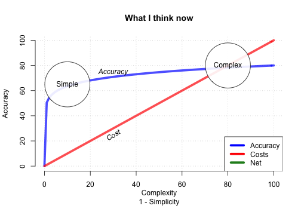


---


---&twocol
## Publication and Collaborators

***=left


FFTrees: A toolbox to create, visualize and evaluate fast-and-frugal decision trees. (2017). *Judgment and Decision Making*, 12(4), 344-368.


***=right


--- .class #id 


```r
install.packages("FFTrees")   # Install FFTrees from CRAN
library("FFTrees")            # Load FFTrees
FFTrees_guide()               # Open the main package guide
```

- Manuscript: FFTrees: A toolbox to create, visualize and evaluate fast-and-frugal decision trees. *Judgment and Decision Making*
- This presentation: [https://ndphillips.github.io/spudm2017haifa/](https://ndphillips.github.io/spudm2017haifa/)
- Github Repository: [http://www.github.com/ndphillips/FFTrees](http://www.github.com/ndphillips/FFTrees)
- ShinyFFTrees: [http://econpsychbasel.shinyapps.io/ShinyFFTrees/](http://econpsychbasel.shinyapps.io/ShinyFFTrees/)
- Email: Nathaniel.D.Phillips.is@gmail.com


---&twocol

***=left

### FFTrees Unfriendly Data

- Many cues, weak validity, ind errors

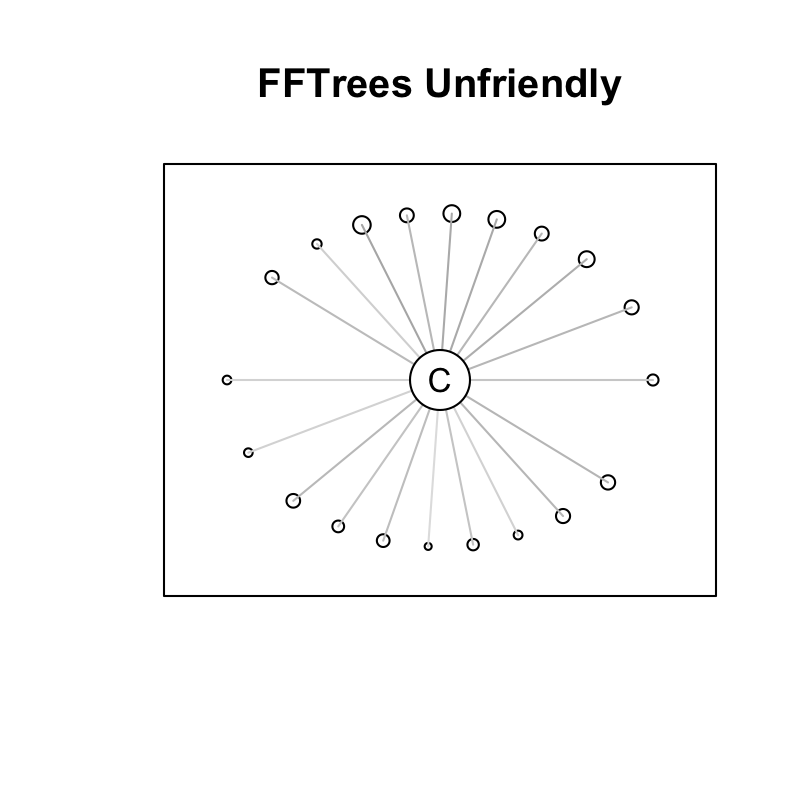


***=right

### FFTrees Friendly Data

- Few cues with high validity, dep errors.

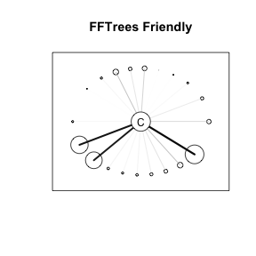


---
## Cue importance

- As calculated by `randomForest`


```
## Error in eval(expr, envir, enclos): object 'heart.fft' not found
```

```
## Error in rownames(heart.fft$comp$rf$model$importance): object 'heart.fft' not found
```

```
## Error in eval(expr, envir, enclos): object 'heart.importance' not found
```

```
## Error in yarrr::pirateplot(formula = importance ~ cue, data = heart.importance, : object 'heart.importance' not found
```


---&twocol

***=left
# Tree Building Algorithm


1. For each cue (aka, feature), calculate a threshold that maximizes `goal.chase` (default: balanced accuracy)
2. Rank order cues by `goal.chase`
3. Select the top `max.levels` (default: 4)
4. Create a "fan" of all possible trees with all possible exit directions.
5. Select the tree that maximizes `goal` (default: balanced accuracy)

***=right

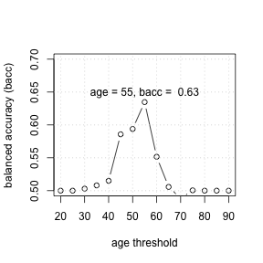


---
### How accurate can FFTs be?


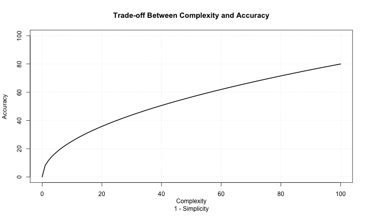


---
### How accurate can FFTs be?


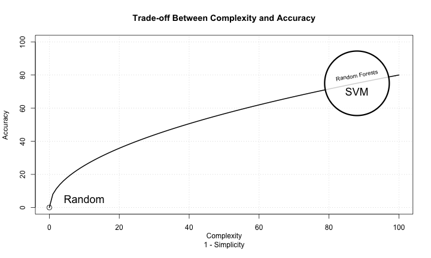


---&twocol

## Conclusion

***=left

### Why use FFTrees?

- See how, and how well, a crazy simple, transparent fast-and-frugal tree can make sense of your data.
- You might be surprised by how well it works, and generate new insights.


```r
library("FFTrees")
    a      
   / \     
0   b  
     / \   
    0   1  
 FFTrees v1.3.2
```

***=right


```
## Growing FFTs with ifan
```

```
## Fitting non-FFTrees algorithms for comparison (you can turn this off with comp = FALSE) ...
```

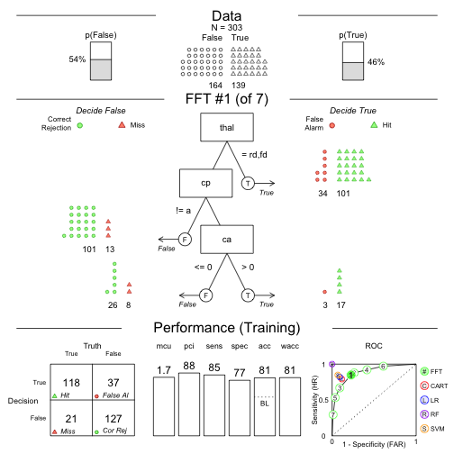


---
# Create a forest of FFTs


```r
heart.fff <- FFForest(formula = diagnosis ~., data = heartdisease)
```


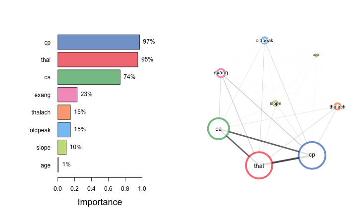


