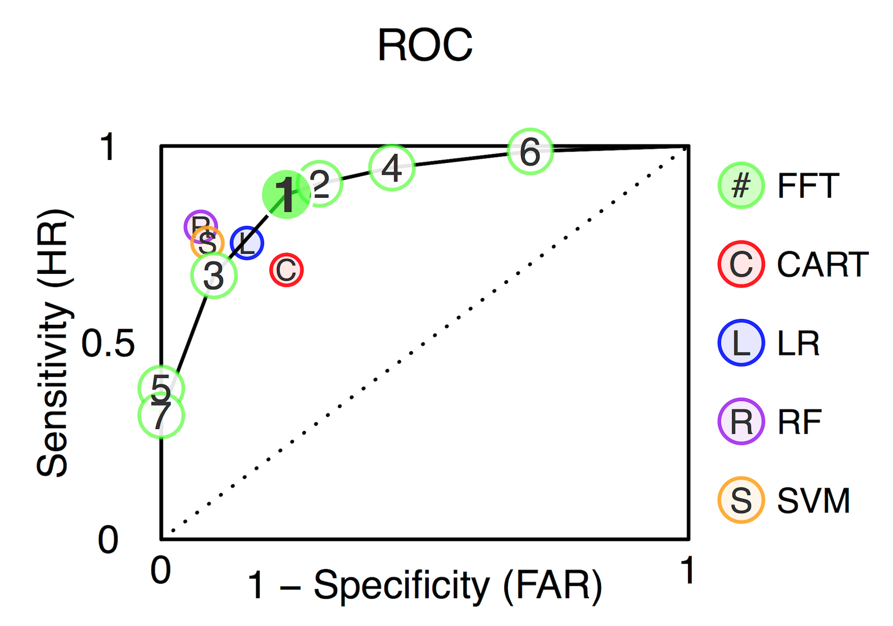
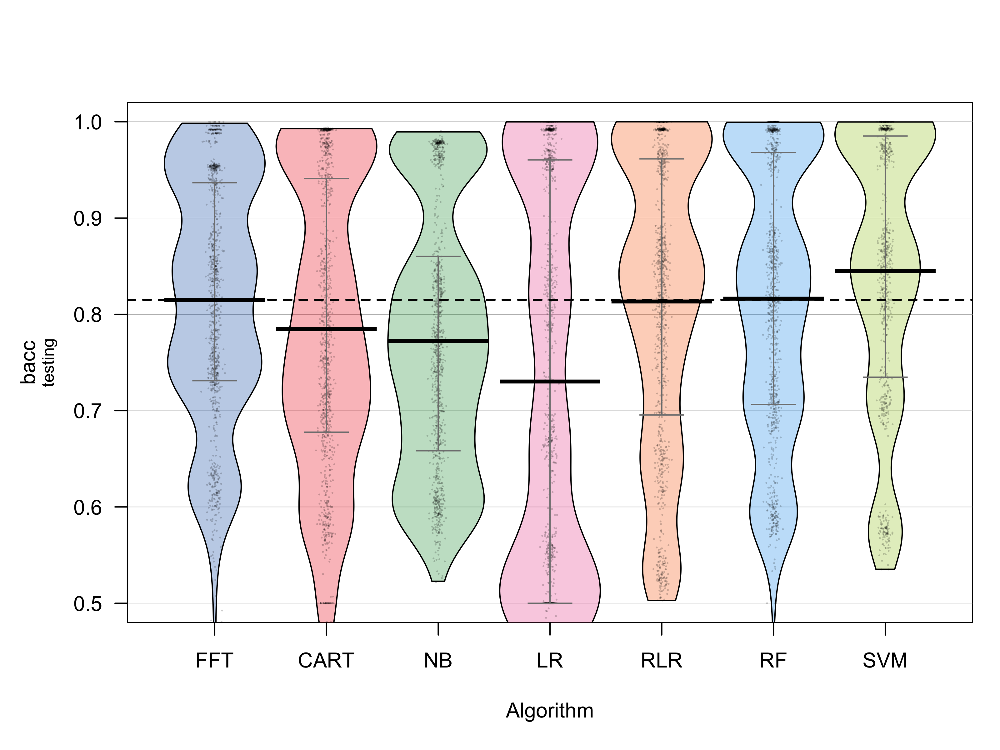
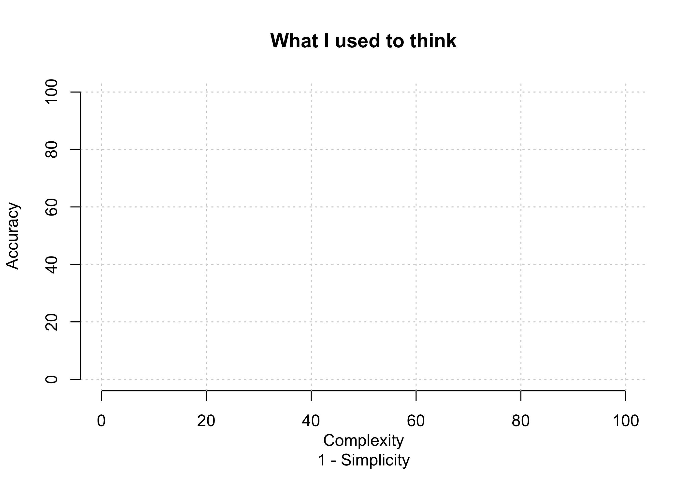
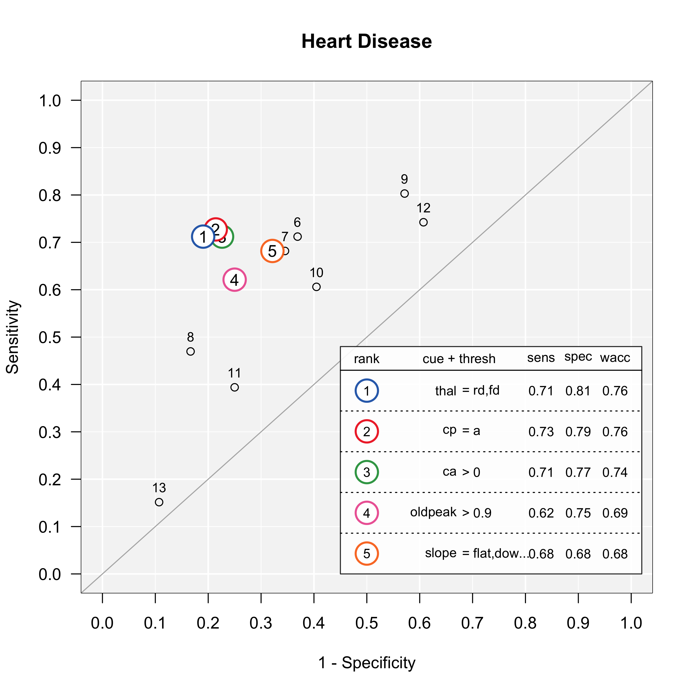
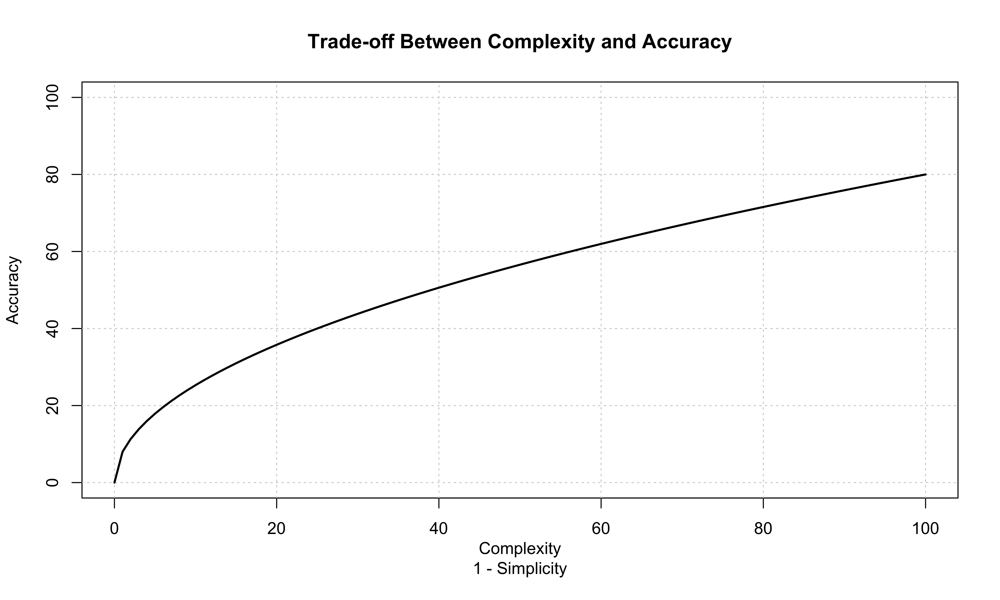
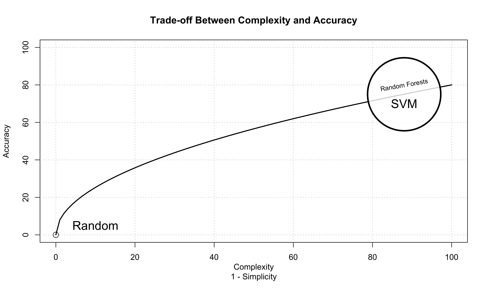

---  .nobackground


### Limited Time. Limited information. How can one make good decisions?

<br>


---&twocol


## Cook County Hospital, 1996

***=left


***=right


"As the city’s principal public hospital, Cook County was the place of last resort for the hundreds of thousands of Chicagoans without health insurance. Resources were stretched to the limit. The hospital’s cavernous wards were built for another century. There were no private rooms, and patients were separated by flimsy plywood dividers. [\...] Doctors once trained a homeless man to do routine lab tests because there was no one else available." Malcolm Gladwell, Blink.


---&twocol

***=left


***=right

### Heart Attack Diagnosis

- How do doctors make decisions? Experience. Intuition. Clinical judgment


- In a Michigan hospital, doctors sent 90% of patients to the ICU, although only 25%  were actually having a heart attack.

---&twocol

## Emergency Room Solution: a fast-and-frugal tree (FFT)

***=left

- A fast-and-frugal decision tree (FFT) developed by Green & Mehr (1997).
- Tree cut the false-alarm rate in half
- Tree is transparent, easy to modify, and accepted by physicians (unlike regression).

### What is a fast-and-frugal decision tree (FFT)?

***=right


Green & Mehr (1997) "What alters physicians' decisions to admit to the coronary care unit?"


--- &twocol

## Fast-and-Frugal Decision Tree (FFT)

- An FFT is a decision tree with exactly two branches from each node, where one, or both, of the branches are exit branches (Martignon et al., 2008)


<!-- #### Descriptive Uses -->

<!-- - Inference (Gigerenzer & Goldstein, 1996) -->
<!-- - Judge's bailing decisions (Dhami, 2003) -->
<!-- - Fish mating (Dugatkin & Godin, 1996) -->

<!-- #### Prescriptive Uses -->

<!-- - Terrorist attacks (Garcia, 2016) -->
<!-- - Bank failure (Neth et al., 2014) -->
<!-- - Depression diagnosis (Jenny et al., 2013) -->


<!-- --- .quote .segue .nobackground -->


<!-- <q>No more entities should be presumed to exist than are absolutely necessary</q> Willam of Occam -->


<!-- --- .quote .segue .nobackground -->


<!-- <q>If a decision tree that measures up very well on the performance criterion is nevertheless totally incomprehensible to a human expert, can it be described as *knowledge?* Under the common-sense definition of this term [...] it is not." </q> (p. 498, Quinlan, 1999) -->


---
# Examples of FFTs


---&twocol
## FFTrees

***=left


- `FFTrees` An easy-to-use R package to create, visualize, and evaluate fast-and-frugal decision trees.


```r
install.packages("FFTrees")
library("FFTrees")
    a      
   / \     
0   b  
     / \   
    0   1  
 FFTrees v1.3.2
```


***=right


---

## Example: Heart Disease


| age| sex|cp | trestbps| chol| fbs|restecg     | thalach| exang| oldpeak|slope | ca|thal   | diagnosis|
|---:|---:|:--|--------:|----:|---:|:-----------|-------:|-----:|-------:|:-----|--:|:------|---------:|
|  63|   1|ta |      145|  233|   1|hypertrophy |     150|     0|     2.3|down  |  0|fd     |         0|
|  67|   1|a  |      160|  286|   0|hypertrophy |     108|     1|     1.5|flat  |  3|normal |         1|
|  67|   1|a  |      120|  229|   0|hypertrophy |     129|     1|     2.6|flat  |  2|rd     |         1|
|  37|   1|np |      130|  250|   0|normal      |     187|     0|     3.5|down  |  0|normal |         0|
|  41|   0|aa |      130|  204|   0|hypertrophy |     172|     0|     1.4|up    |  0|normal |         0|
|  56|   1|aa |      120|  236|   0|normal      |     178|     0|     0.8|up    |  0|normal |         0|

- Goal: Predict diagnosis as a function of cues.
- Regression: 6 significant cues (sex, cp, thalach, exang, oldpeak, ca)


---

## 3 Steps to creating FFTs with FFTrees


```r
# Step 0: Install FFTrees (v.1.3.2)
install.packages("FFTrees")

# Step 1: Load the package
library("FFTrees")

# Step 2: Create an fft decision model with FFTrees
heart.fft <- FFTrees(formula = diagnosis ~.,
                     data = heart.train,
                     data.test = heart.test,
                     main = "Heart Disease",
                     decision.labels = c("Low-Risk", "High-Risk"))
```


---

## Print an `FFTrees` object


```r
heart.fft
```


```r
Heart Disease
7 FFTs predicting diagnosis (Low-Risk v High-Risk)
FFT #1 uses 3 cues: {thal,cp,ca}

                   train   test
cases       :n    150.00 153.00
speed       :mcu    1.74   1.73
frugality   :pci    0.88   0.88
accuracy    :acc    0.80   0.82
weighted    :wacc   0.80   0.82
sensitivity :sens   0.82   0.88
specificity :spec   0.79   0.76

pars: algorithm = 'ifan', goal = 'wacc', goal.chase = 'bacc', sens.w = 0.5
```

---
## Print a tree "in words"


```r
inwords(heart.fft)
```


```r
[1] "If thal = {rd,fd}, predict High-Risk"            
[2] "If cp != {a}, predict Low-Risk"  
[3] "If ca <= 0, predict Low-Risk, otherwise, if ca > 0, predict High-Risk"
```


| cue| definition|Possible values |
|:------|----:|:-----|
|     thal: thallium scintigraphy| How well blood flows to the heart     |normal (n)fixed defect (fd), or reversible defect (rd)|
|     cp: chest pain type| Type of chest pain     | typical angina (ta), atypical angina (aa), non-anginal pain (np), or asymptomatic (a).|
|     ca: |number of major vessels colored by flourosopy     |0, 1, 2, 3    |


---


```r
plot(heart.fft, stats = FALSE)
```


---


```r
plot(heart.fft)  # Training data
```


---


```r
plot(heart.fft, data = "test")   # Testing data
```


---



---


```r
plot(heart.fft, data = "test", tree = 6)   # Testing data, tree 6
```


---


```r
plot(heart.fft, data = "test", tree = 7)   # Testing data, tree 7
```


---&twocol

***=left

## Generalizing FFTrees

- The `FFTrees` package can be used with any dataset with a binary criterion.
- Simulation: 10 diverse datasets taken from the UCI Machine Learning Database.
- FFTrees vs. regression, Naive Bayes, Rnd For and more

### How well can a simple fast-and-frugal tree predict data?  

***=right


--- .class #id 
## Speed and frugality


--- .class #id 
## Speed and frugality


--- .class #id 
## Prediction accuracy across 10 datasets


--- .class #id 


---
### Mushrooms


---
### Breast Cancer


---
### Titanic


---

### Additional functions and arguments


---&twocol

***=left
### Define an FFT manually


```r
# Create an FFT manually
FFTrees(formula = diagnosis ~.,
data = heart.train,
my.tree = "If chol > 350, predict True. 
           If cp != {a}, predict False. 
           If age <= 35, predict False.
           Otherwise, predict True")
```


***=right




---&twocol
### Include cue costs

***=left
`heart.cost`

|   |cue      |  cost|
|:--|:--------|-----:|
|2  |sex      |   1.0|
|13 |thal     | 102.9|
|3  |cp       |   1.0|
|12 |ca       | 100.9|
|4  |trestbps |   1.0|


```r
# Original FFT (without costs)
FFTrees(formula = diagnosis ~.,
 data = heart.train)
```


***=right

### Original FFT (without costs)




---&twocol
### Include cue costs

***=left
`heart.cost`

|   |cue      |  cost|
|:--|:--------|-----:|
|2  |sex      |   1.0|
|13 |thal     | 102.9|
|3  |cp       |   1.0|
|12 |ca       | 100.9|
|4  |trestbps |   1.0|


```r
# Create an FFT that is cheap
FFTrees(formula = diagnosis ~.,
 data = heart.train,
 cost.cues = heart.cost,
 cost.outcomes = c(0, 200, 100, 0))
```


***=right


### Cheap FFT


---
# Create a forest of FFTs


```r
heart.fff <- FFForest(formula = diagnosis ~., data = heartdisease)
```


---&twocol

## Conclusion

***=left

### Why use FFTrees?

- See how, and how well, a crazy simple, transparent fast-and-frugal tree can make sense of your data.
- You might be surprised by how well it works, and generate new insights.


```r
library("FFTrees")
    a      
   / \     
0   b  
     / \   
    0   1  
 FFTrees v1.3.2
```

***=right


---&twocol
## Publication and Collaborators

***=left

### Publication

Phillips, Nathaniel D., Neth, Hansjoerg, Woike, Jan & Gaissmeier, Wolfgang. (2017). FFTrees: A toolbox to create, visualize and evaluate fast-and-frugal decision trees. *Judgment and Decision Making*.

### Collaborators

- Wolfgang Gaissmaier (University of Konstanz)
- Hansjoerg Neth  (University of Konstanz)
- Jan Woike  (MPI for Human Development)

***=right


--- .class #id 

### FFTrees

- FFTrees: `install.packages("FFTrees")`, http://www.github.com/ndphillips/FFTrees

#### My Links

- This presentation: [https://ndphillips.github.io/useRJuly2017](https://ndphillips.github.io/useRJuly2017)
- Website: https://ndphillips.github.io
- Email: Nathaniel.D.Phillips.is@gmail.com


---&twocol

***=left

### FFTrees Unfriendly Data

- Many cues, weak validity, ind errors


***=right

### FFTrees Friendly Data

- Few cues with high validity, dep errors.




---&twocol

***=left
# Tree Building Algorithm


1. For each cue (aka, feature), calculate a threshold that maximizes `goal.chase` (default: balanced accuracy)
2. Rank order cues by `goal.chase`
3. Select the top `max.levels` (default: 4)
4. Create a "fan" of all possible trees with all possible exit directions.
5. Select the tree that maximizes `goal` (default: balanced accuracy)

***=right


---


```r
plot(heart.fft, what = "cues")
```




---

### When should I consider an FFT?


---
### Conclusion





--- .class #id 

### Conclusion


--- .class #id 

### Conclusion


---
### How accurate can FFTs be?


---
### How accurate can FFTs be?


---
### Forest Fires (Training)


---
### Forest Fires (Testing)


---
### Forest Fires (Testing)


